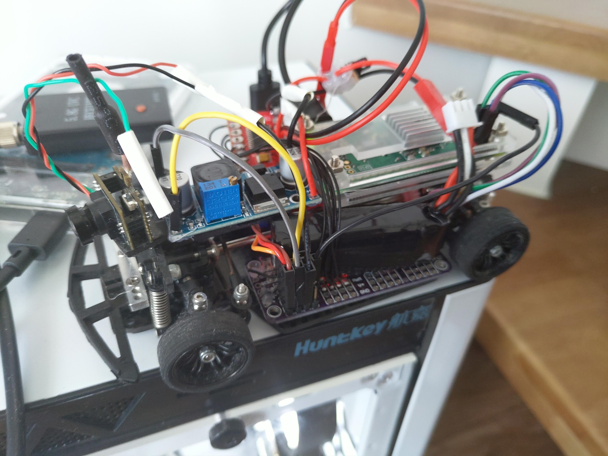

# Advancd RC Car Project

This is a personal project that adds fun to a RC car.

I will post my progress here as reference for me and for anybody who would love to modify their RC car.

## 2019 July 28

1. Changed the original rc control circuit to a raspberry pi base circuit.  
    -  I used a PCA 9685 for control all the car devices, including the servo and motor's H bridge . This simplify the connection between
    pi and all the car devices to a 2 pin i2c. Meanwhile,the 16 pwm channels pca 9685 provided leaves enough upgrade space.
    
    - Raspberry pi zero W is used here for main controller here, but I think it is over kill for now(remote control only)
    
    - I replacing the original speed controller to a H bridge board(tb6612fng) for more control over the motor, but
    it is too weak for the motor and its get overheat very easily. I am about upgrade this.
    
1. I used for g27 wheel for controlling my car. I even implemented the first gear and reverse gear.
    - I used a simple upd protocol form communication between g27 and rc car. Code are provided below.
        + server side: a sim le udp server that obtain five pwm value. [Code](RC_side_udp_server.py)
        + client side : Pygame is used for getting value from g27. When g27 updates its status, I calculated the corresponding
        pwm value for rc car and send it over via udp. [Code](G27_udp_client.py)      